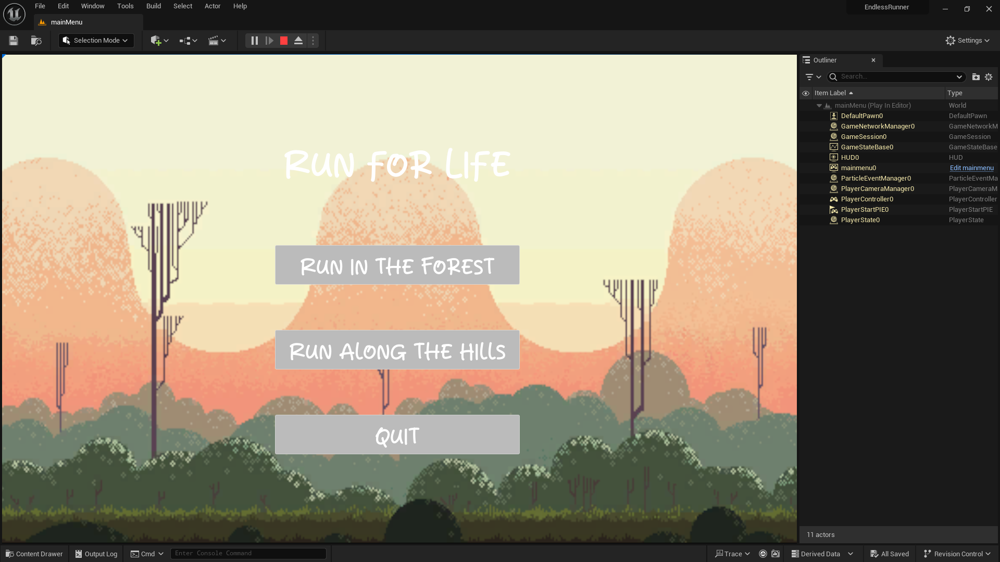
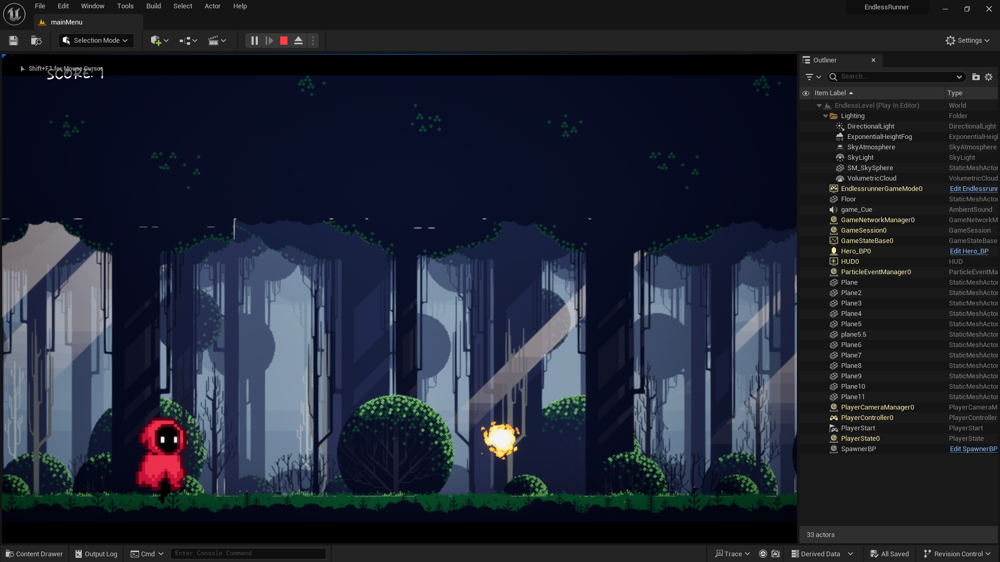
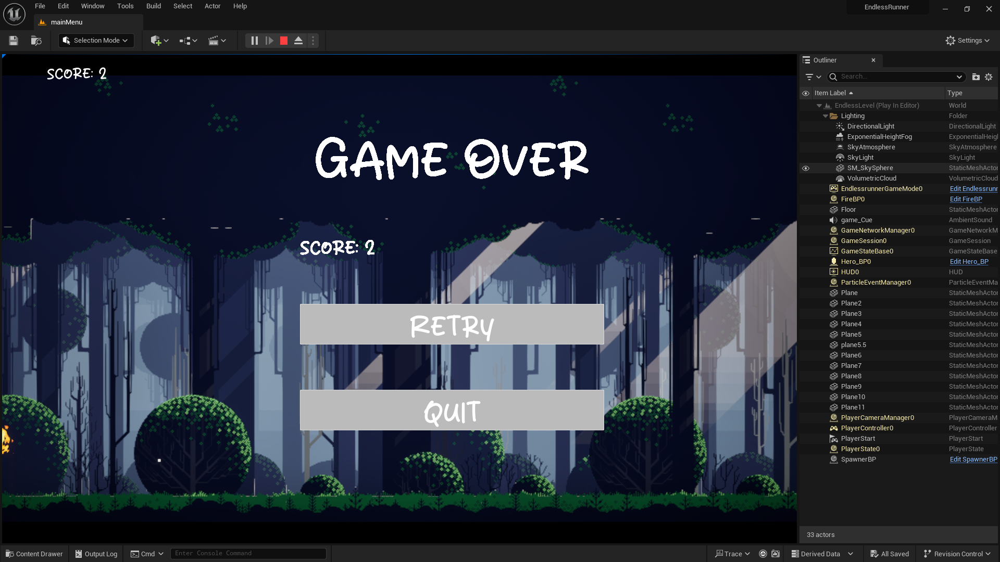

# Endless Runner Game - UE5.3

This is an endless runner game inspired from Chrome Dino (yes, the no internet connection game). This game uses parallax effect to give a feeling that the hero is running, while it actually is stationary.

## Pre-requisite
Unreal Engine 5.3 - Install from Epic Games

### Parallax Effect

Parallax effect is a visual phenomenon where the position or direction of an object differs when viewed from different angles or lines of sight. Here, I have implemented parallax effect by having different layers of the background. The farthest one moves the slowest and the nearest moves the fastest, while the hero is stationary. This layered movement creates the optical illusion that the hero is running through the environment.

##  To play or edit this game
Open the EndlessRunner.uproject file using UE5.3

## Inputs
Simple inputs - Press Space to Jump and avoid the Obstacles

## Preview

